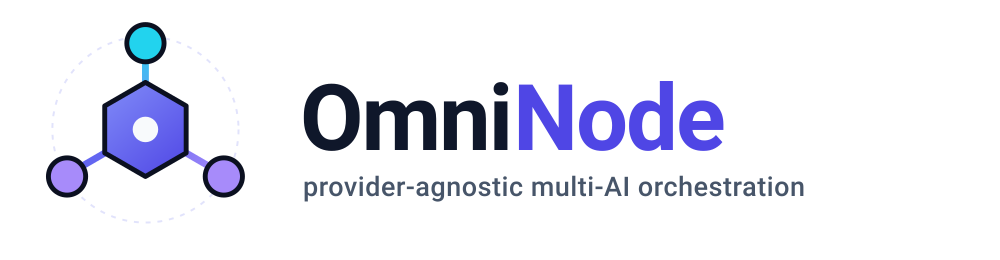

<p align="center">
  
</p>

<h1 align="center">OmniNode</h1>

[](https://github.com/Hilbras/OmniNode/actions/workflows/ci.yml)
[](https://www.npmjs.com/package/@hilbras/omninode)
[](https://www.npmjs.com/package/@hilbras/omninode)
[](https://www.npmjs.com/package/@hilbras/omninode)
[](LICENSE)
[](docs/ROADMAP_V2.md)

**OmniNode** is a provider-agnostic multi-AI orchestration platform. It coordinates
CLI-based AI agents, AI providers, persistent memory, roles, reports and planning
into a unified execution system — so multiple AI systems can collaborate on complex
software engineering and knowledge-work tasks.

OmniNode is **not an AI provider** and is **not dependent on OmniHilbras** (or on
OpenAI, Gemini, DeepSeek, Qwen, or any other specific vendor). It orchestrates
existing intelligence; it does not try to become another model.

## Status

**v1.0.0 is feature complete. v2.0.0 — the reliability and interoperability
release — is in progress**, shipping as tagged prereleases (`v2.0.0-alpha.N`).

### v1.0.0 delivered

| Capability | Where |
| --- | --- |
| Provider abstraction, custom providers, model discovery | [`src/providers/`](src/providers) |
| OmniHilbras integration (optional) | `src/providers/omnihilbras` |
| CLI agents (stdin / arg / protocol modes), agent registry | [`src/agents/`](src/agents) |
| Roles, tasks with lifecycle and retry | `src/roles`, [`src/tasks/`](src/tasks) |
| Pipelines: DAG scheduling, fan-out research, conditions, retries | [`src/pipelines/`](src/pipelines) |
| Multi-AI reports with aggregation and conflict detection | [`src/reports/`](src/reports) |
| Planner (model-backed with heuristic fallback) | [`src/planner/`](src/planner) |
| Memory (local + Remembera) wired into the task loop | [`src/memory/`](src/memory) |
| End-to-end workflow in one command | `omninode run <pipeline> "<objective>"` |
| Audit log, security model, examples, Docker runtime | [`src/audit/`](src/audit), [docs/SECURITY.md](docs/SECURITY.md) |

### v2.0.0 shipped — all 24 phases

| # | Phase | Outcome |
| --- | --- | --- |
| 1 | Architecture & API stabilization | shared persistence base, guarded public API, deprecation policy |
| 2 | Execution reliability | `unknown` ≠ `failed`, attempts, execution identity, timeouts |
| 3 | Agent Protocol v2 | versioned, correlated envelopes, malformed input never crashes |
| 4 | Agent adapter hardening | process-tree cleanup, env policies, output limits, cwd confinement |
| 5 | Pipeline lifecycle | cancellation, partial/unknown propagation, interrupted-run detection |
| 6 | Provider infrastructure | model metadata, `connect`/`getModel`, normalized error kinds |
| 7 | OmniHilbras v2 | gateway metadata, streaming, enforced separation |
| 8 | Memory v2 | formal contract, categories, budgeted retrieval, `required` policy |
| 9 | Report system v2 | validated reports, typed evidence, provenance |
| 10 | Aggregation | agreements, conflicts (both positions preserved), confidence |
| 11 | Planner v2 | full input, plan validation, structured errors, provider-agnostic |
| 12 | Persistence | atomic writes, corruption quarantine, schema v2 + migration |
| 13 | Security hardening | inline-secret refusal, static guards, `security audit` |
| 14 | Audit & observability | correlated events, JSON logs, `inspect` diagnostics |
| 15 | CLI v2 | exit codes, `config` group, `pipeline create`, `--json` |
| 16 | Configuration v2 | precedence, profiles, `OMNINODE_*`, diagnostics |
| 17 | Testing expansion | explicit failure matrix + regression tests |
| 18 | Documentation overhaul | complete document set, rewritten README |
| 19 | API & package quality | curated public surface with CI guards, boundary validation, verified package contents |
| 20 | Performance & resources | bounded reports/context/audit log, concurrency limits, released handles |
| 21 | Developer experience | predictable scripts, local dev guide, verified extension guides |
| 22 | CI/CD hardening | release gates (version/package/secrets), audit, Node 20/22/24 |
| 23 | Migration tooling | `omninode migrate` covers storage + config v1 patterns |
| **24** | **Final hardening** | **full audit — architecture, security, reliability, protocol, performance: PASS** |

The roadmap is [docs/ROADMAP_V2.md](docs/ROADMAP_V2.md); the completed v1 plan is
[docs/DEVELOPMENT_PLAN.md](docs/DEVELOPMENT_PLAN.md).

## Documentation

| Document | What it covers |
| --- | --- |
| [Configuration](docs/CONFIGURATION.md) | source precedence, profiles, secrets, diagnostics |
| [CLI](docs/CLI.md) | command groups, output modes, exit codes, recipes |
| [Agents](docs/AGENTS.md) | registering agents, input modes, process handling, native adapters |
| [Pipelines](docs/PIPELINES.md) | pipeline definitions, step kinds, scheduling, results |
| [Agent Protocol v2](docs/PROTOCOL.md) | the interoperability spec external agents implement |
| [Providers](docs/PROVIDERS.md) | the provider contract, metadata, error normalization |
| [Memory](docs/MEMORY.md) | the memory contract, categories, retrieval, migration |
| [Reports](docs/REPORTS.md) | report schema, validation, aggregation, conflicts |
| [Persistence](docs/PERSISTENCE.md) | storage interfaces, durability, corruption, migration |
| [Security](docs/SECURITY.md) | secrets, process execution, trust model, sandbox boundary |
| [Testing](docs/TESTING.md) | the failure matrix and regression-test discipline |
| [Troubleshooting](docs/TROUBLESHOOTING.md) | symptom → cause → fix |
| [Migration](docs/MIGRATION.md) | v1 → v2 (compat, storage, config, protocol) |
| [Contributing](docs/CONTRIBUTING.md) · [Development](docs/DEVELOPMENT.md) · [Extending](docs/EXTENDING.md) | setup, scripts, local workflow, extension guides |
| [Architecture](docs/ARCHITECTURE.md) | module map, workflow, execution states, audit |
| [API](docs/API.md) · [API stability](docs/API_STABILITY.md) · [Deprecations](docs/DEPRECATIONS.md) | the public surface and its guarantees |
| [CHANGELOG](CHANGELOG.md) · [v1 plan](docs/DEVELOPMENT_PLAN.md) · [v2 roadmap](docs/ROADMAP_V2.md) | history and plans |
| [assets/](assets) | logo (`logo.svg`), favicon, wordmark |

## Roadmap

The v1 plan (phases 0–11) is complete and shipped as **v1.0.0** — see
[docs/DEVELOPMENT_PLAN.md](docs/DEVELOPMENT_PLAN.md). The v2 roadmap
(24 phases) is in progress — see [docs/ROADMAP_V2.md](docs/ROADMAP_V2.md):

| Version | Milestone |
| --- | --- |
| v0.1.0 – v0.10.0 | Foundation → end-to-end workflow |
| **v1.0.0** | Production Release (v1 plan complete) |
| **v2.0.0** | Reliability & interoperability release (all 24 phases complete) |

Install prereleases with:

```bash
npm install -g @hilbras/omninode@next
```

Core architectural rule: OmniNode must run successfully with **zero Hilbras
dependencies**. OmniHilbras and Remembera make it more powerful, but neither is
required for the core engine.

## Install

```bash
npm install -g @hilbras/omninode          # stable (v2.0.0)
npm install -g @hilbras/omninode@next     # v2 prereleases
```

Or as a library: `npm install @hilbras/omninode`. Node.js 20+.

Prefer a container? `docker build -t omninode .` then
`docker run --rm -v "$PWD:/work" -w /work omninode run my-pipeline "audit the repo"`.

## Quick start

```bash
omninode init                                   # writes omninode.yaml
omninode provider add --name my-gateway \
  --base-url https://api.example.com/v1 --api-key-env-var MY_API_KEY
omninode agent add --name researcher --command some-agent --input-mode stdin
```

Describe the work as a pipeline — in `omninode.yaml`:

```yaml
project:
  memory:
    provider: local            # or: remembera
  planner:
    kind: model
    model: my-gateway:chatgpt
  pipelines:
    - id: repo-audit
      steps:
        - id: research         # independent analyses, run in parallel
          kind: research
          agents: [researcher, second-opinion]
        - id: plan             # findings + memory → typed implementation plan
          kind: plan
        - id: execute          # hand the plan to an execution agent
          kind: execute
          agent: researcher
```

…then run the whole loop in one command:

```bash
omninode run repo-audit "Audit the authentication module"
```

```
  [research] completed
  [plan] completed
  [execute] completed
  reports: 2 structured report(s)
  combined report: combined-m4f2
  plan: plan-a91
  result: Fixed JWT verification and added regression tests.
Pipeline completed. Run id: run-a91
```

Inspect what happened, in text or JSON:

```bash
omninode pipeline inspect run-a91
omninode report combined
omninode plan show plan-a91
omninode task inspect task-… --json | jq .
omninode audit -n 50
```

Prefer to start from something runnable? [`examples/demo/`](examples/demo/)
contains a complete project and `./demo.sh` that exercises the full loop with
agents that need no external tools.

## Connecting OmniHilbras

OmniHilbras is one provider source among many — always optional. The core
architectural rule stands: OmniNode runs with **zero Hilbras dependencies**.

The dedicated adapter implements the plan's connect flow on top of the
gateway's OpenAI-compatible API surface and tags discovered models with
`gateway: omnihilbras` metadata:

```bash
omninode provider add --name omnihilbras --type omnihilbras \
  --base-url https://your-omnihbras-host/v1 \
  --api-key-env-var OMNIHILBRAS_API_KEY

omninode provider test omnihilbras --connect   # full connect flow + registration
omninode models omnihilbras                    # list the gateway's models
```

## License

[MIT](LICENSE)
